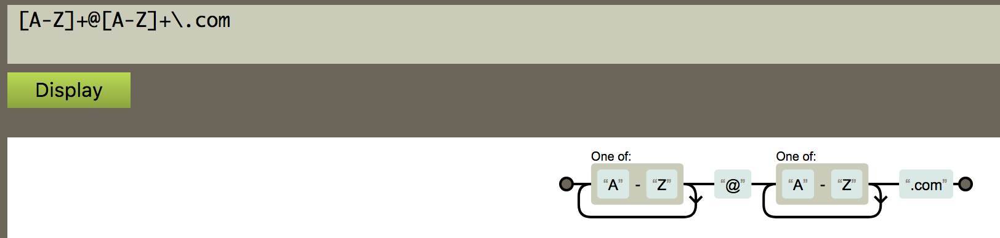

# Robot Name

Write a program that manages robot factory settings.

When robots come off the factory floor, they have no name.

The first time you boot them up, a random name is generated, such as
_RX837_ or _BC811_. The names are comprised of two uppercase letters and a three digit number.

Every once in a while we need to reset a robot to its factory settings,
which means that their name gets wiped. The next time you ask, it will
respond with a new name.

## Regular Expressions

So how does the test spec guarantee that all robot names match the given pattern?  The answer is **Regular Expressions**.  

Looking at the `robot_name_spec.rb` file you will notice this line:

```ruby
NAME_REGEXP = /^[A-Z]{2}\d{3}$/
```
In Ruby text between `/` and `/` are regular expressions, a type of value that describes a pattern of text.  

The caret (^) character indicates the beginning of a line.  Text inside square brackets ([]) are considered a sequence of characters that can match.

So `/^[A-Z]/` would match any text which starts with a letter between A and Z (capitalized), and ^[A-Za-z] would match any text which starts with an alphabetic character regardless of case.  

The curly braces ({ }) allow you to specify how many times a sequence appears.  So `/^[A-Z]{2}/` would match 2 letters where each character is between A & Z.  

`\d` indicates a digit, so `/\d{3}/` matches any 3 digit number.  

Lastly the dollar sign ($) indicates the end of the line.  

Putting it all together `/^[A-Z]{2}\d{3}$/` matches a line which starts with two capitalized letters followed by 3 digits and then ends the line.

In the spec file, the tests verify that any Robot name must match the regular expression.  

[REGEXPER](https://regexper.com/) is a very handy tool which takes a regular expression and converts it to a graphical drawing.  



## Source
A debugging session with Paul Blackwell at gSchool. [view source](http://gschool.it)
